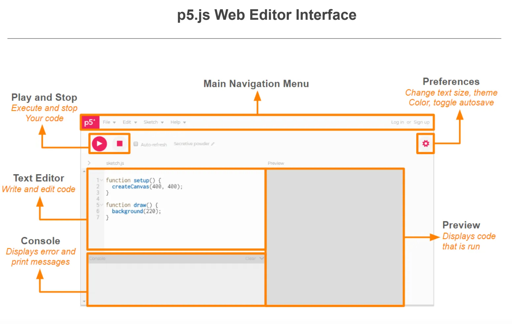

# module-1 Let's Make the Canvas Move

## Summary
- Introduction to Drawing with Code
- Errors, Console, and Comments
- Color Theory

## Introduction to Drawing with Code

- open your online [p5.js editor](http://editor.p5js.org) (<em>Remember to sign up/login into your account</em>)
    - [Sign up for p5.js online editor account](https://editor.p5js.org/signup)

- Here is the layout of your online editor:
    
    Image from ([p5.js website](https://p5js.org/tutorials/setting-up-your-environment/))

- Name, Save, and Run Your First Sketch
    - <b>Name Your Project</b>: Click on the <b>pencil icon</b> above the text editor and type name for your project.
    - <b>Save Your Project</b>: Click on <b>File</b> in the top toolbar and select “Save”. Ensure you are logged in to save your work.
    - <b>Run Your Code</b>: Click the <b>Play button</b>  in the top-left corner to view the output of your code.
- The editor begins with the following code in the <em>sketch.js</em> file:
    - setup() is a function that's called once when the sketch begins running. [learn more](https://p5js.org/reference/p5/setup/)
    - draw() is a function that called repeatedly while the sketch runs.[learn more](https://p5js.org/reference/p5/draw/)
- This 7mins Video is a great source for you to get familiar with the editor
    <iframe width="560" height="315" src="https://www.youtube.com/embed/MXs1cOlidWs?si=_97zKDg1jJQPwAMT" title="YouTube video player" frameborder="0" allow="accelerometer; autoplay; clipboard-write; encrypted-media; gyroscope; picture-in-picture; web-share" referrerpolicy="strict-origin-when-cross-origin" allowfullscreen></iframe>
    <!-- - order of the code:
        - setup() (line by line)
        - draw() (line by line, once finished, start from the first line)
        
                function setup() {
                createCanvas(400, 400);
                }

                function draw() {
                background(220);
                } -->

           

## Errors, Console, and Comments
- Understanding Errors
    - <b>Syntax Errors</b>: Syntax errors occur when the code is not written correctly according to the programming language's rules

            // Example: Missing closing parenthesis
            console.log("Hello World"; // SyntaxError: missing ) after argument list
            cosole.lof("Hello World"); // SyntaxError: typo error
            console.log("Hello World"); // correct syntax, no syntax error

    - <b>Runtime Errors</b>: Runtime errors happen when the code encounters an issue during execution, even if the syntax is correct

            // this normal happens when your syntax is correct but there is some other issues
            // Example: Undefined variable
            console.log(x); // ReferenceError: x is not defined
            ----------------------------------------------------------------
            let x = "Define the variable first";
            console.log(x); // x is defined, so no error

- Using the Console
    - <b>Console.log()</b>: This function helps you print messages to the console, which is useful for debugging.

            let name = "Alice";
            console.log(name); // Output: Alice
            
    - <b>Error Messages</b>: The console will display error messages that indicate what went wrong and often provide a line number.

            let y = 10;
            console.log(x); // ReferenceError: x is not defined
            // you should be able to see ReferenceError: x is not defined in your console 

    - <b>Breakpoints</b>: Use breakpoints to pause execution at certain points to inspect variables and understand the program flow.
    
            function multiply(a, b) {
            let product = a * b;
            return product;
            }

            let result = multiply(5, 7);
            console.log(result); // Set a breakpoint on this line to inspect the value of 'result'

- Writing Comments
    - <b>Single-Line Comments</b>: Use // to write comments that are on a single line.

            
            // This is a single line comment
            // if you want to write comments using //, you have to use it for all comments
            
    - <b>Multi-Line Comments</b>: Use /* ... */ to write comments that span multiple lines.
            
            /*
            This is a multiple lines comment
            You can write as many comments as you want in this block
            */
            
    - <b>Purpose of Comments</b>: Comments help explain the code, making it easier to understand for yourself and others. They can also be used to temporarily disable code.
    
## Color Theory
- Basic Color Functions
    - <b>fill()</b>: Sets the color used to fill shapes.

            function setup() {
            createCanvas(400, 200);
            fill(255, 0, 0); // Red fill
            rect(50, 50, 100, 100); // Draw a rectangle
            }

        <iframe src="https://editor.p5js.org/JimmyXwtx/full/y8NyVSOBx" width="400px" height="250px"></iframe>

    - <b>stroke()</b>: Sets the color used for lines and borders around shapes.

            function setup() {
            createCanvas(400, 200);
            stroke(0, 255, 0); // Green stroke
            noFill(); // No fill
            ellipse(100, 100, 100, 100); // Draw a circle
            }

        <iframe src="https://editor.p5js.org/JimmyXwtx/full/Rz9Rd76aw" width="400px" height="250px"></iframe>
        
    - <b>background()</b>: Sets the color used for the canvas background.

            function setup() {
            createCanvas(400, 250);
            background(0, 0, 255); // Blue background
            }

        <iframe src="https://editor.p5js.org/JimmyXwtx/full/2CVwVbWUB" width="400px" height="250px"></iframe>

- Color Modes
    - <b>RGB (Red, Green, Blue)</b>: The default color mode, using values from 0 to 255.

            function setup() {
            createCanvas(400, 400);
            background(255, 0, 0); // Red background
            }

        <iframe src="https://editor.p5js.org/JimmyXwtx/full/RhtaG9d1S" width="400px" height="250px"></iframe>

    - <b>HSB (Hue, Saturation, Brightness)</b>: A more intuitive color model for creating colors.

            function setup() {
            createCanvas(400, 400);
            colorMode(HSB);
            background(200, 100, 100); // Set background using HSB
            }

        <iframe src="https://editor.p5js.org/JimmyXwtx/full/RhtaG9d1S" width="400px" height="250px"></iframe>
        

- [Color Palettes/Color Scheme](https://copic.too.com/blogs/educational/analogous-complimentary-and-split-complementary-color-schemes)
    - <b>Analogous Colors</b>: Colors that are next to each other on the color wheel.
    - <b>Complementary Colors</b>: Colors that are opposite each other on the color wheel.
    - <b>Triadic Colors</b>: Three colors that are evenly spaced around the color wheel.
- Using Colors in p5.js
    - <b>Hexadecimal Colors</b>: Use #RRGGBB format for specifying colors.
    - <b>Transparency</b>: Use rgba() for colors with transparency (alpha channel).
