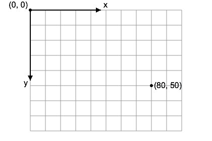

# module-2 Let's starting coding with p5

## Summary
- Basic DataType and Variables 
- Start Coding
- Transformations

## Basic DataType
- Numbers
    - int: Represents an integer, which is a whole number.
             
            
                var integerExample = 15; // an integer 
                var int = 15; // an integer
            
    - float: Represents a floating-point number, which includes numbers with a decimal point.
         
           
                var floatExample = 0.323; // a floating-point number 
                var float = 0.123 // a floating-point number
          
- Text
    - string: Represents a sequence of characters used to store text.
             
            
                var text = "Hello, world!"; // a string i.e., a sequence of characters
           
- Variables
 
<em>Variables are used for storing values. In JavaScript, var, let, and const are used for variable declaration.</em>
- var: Function-scoped. 
 
<em>A variable declared with var is defined throughout the function in which it is declared.</em>
 

            
            function exampleFunction() {
            var functionScoped = "I am function scoped";
            console.log(functionScoped); // Output: I am function scoped
            }
            exampleFunction();

- let and const: 
 
<em>Block-scoped. Variables declared with let or const are only accessible within the block (enclosed by {}) in which they are declared.</em>

            function exampleFunction() {
                if (true) {
                    let blockScoped = "I am block scoped";
                    const alsoBlockScoped = "I am also block scoped";
                    console.log(blockScoped); // Output: I am block scoped
                    console.log(alsoBlockScoped); // Output: I am also block scoped
                }
                // blockScoped and alsoBlockScoped are not accessible here
                console.log(blockScoped); // Error: blockScoped is not defined
                console.log(alsoBlockScoped); // Error: alsoBlockScoped is not defined
            }
            exampleFunction();
     

## Start Coding

- Understanding how js code works:
    - Simple Explanation
        - <b>Read the Code</b>: JavaScript reads your p5.js code from top to bottom.
        - <b>Setup Function</b>: Runs once at the beginning to set up the initial environment.
        - <b>Draw Function</b>: Runs repeatedly (typically 60 times per second) to create animations or updates.
    - Example

            function setup() {
            createCanvas(400, 400); // Sets up a canvas of 400x400 pixels
            }

            function draw() {
            background(220); // Clears the canvas with a grey background
            ellipse(200, 200, 50, 50); // Draws a circle at (200, 200) with a diameter of 50
            }

    - Execution Steps
        1. Start:
            - JavaScript reads the entire script.
            - Recognizes setup and draw functions.
        2. Run setup:        
            - Executes everything inside the setup function.
            - createCanvas(400, 400); creates a canvas of 400x400 pixels.
        3. Run draw repeatedly:
            - Executes everything inside the draw function over and over.
            - background(220); clears the canvas to a grey color.
            - ellipse(200, 200, 50, 50); draws a circle in the middle of the canvas.

- Canvas
    - Coding on p5.js feels like drawing on the canvas via code
    - You are drawing on this coordinate system
    

- Shapes
    - Shapes are the basic of p5.js, you can use the predefined shape functinos to draw a shape
    - [point](https://p5js.org/reference/p5/point/)
    - [line](https://p5js.org/reference/p5/line/)
    - [Rect](https://p5js.org/reference/p5/rect/)
    - [ellipse](https://p5js.org/reference/p5/ellipse/)
    - [Customized Shape](https://p5js.org/reference/p5/beginShape/)
    - [learn more](https://p5js.org/reference/)